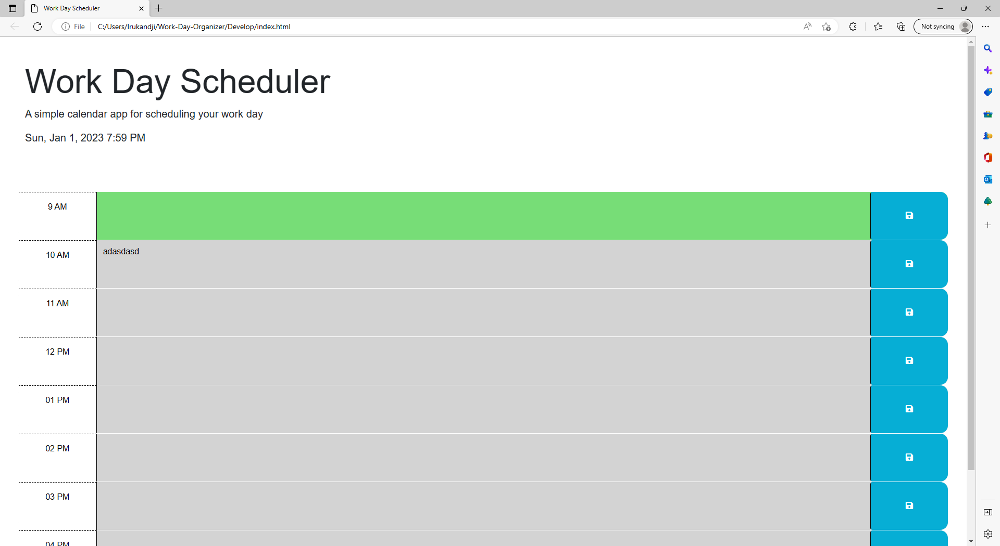

# 05 Third-Party APIs: Work Day Scheduler

# Project 3

This project had pre-existing code, our intent was to create a work day scheduler to help you manage your daily activities.

## Screenshots

## 🔗 Links

https://kking91.github.io/Project-3/